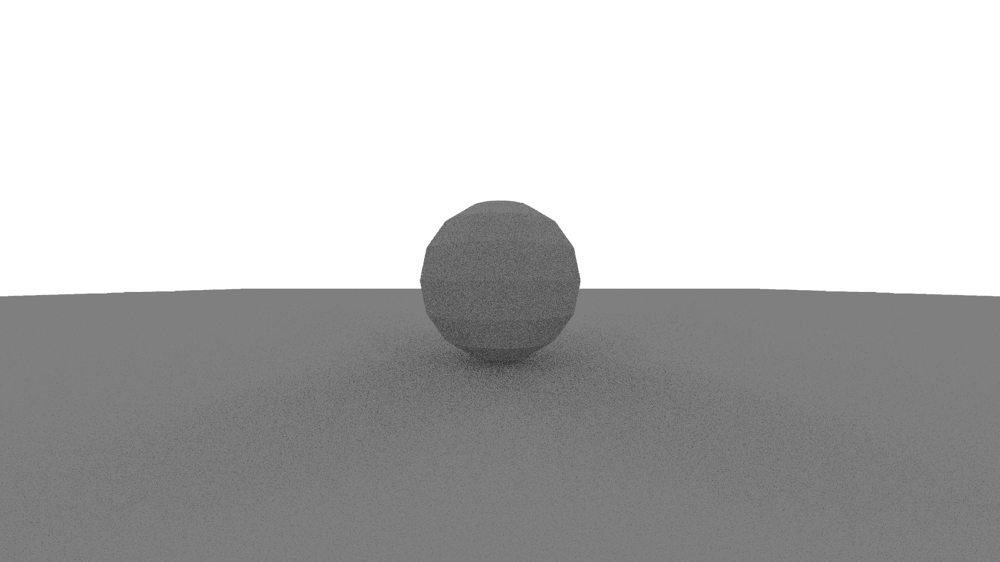

# A CPU ray tracer written in Rust.

Features:
- Partial support for .obj models

Todo:
- [ ] Support for other image formats (at least .bmp, maybe .png)
- [ ] Better support for .obj models (textures, normals)
- [ ] Support for .mtl files
- [ ] BVH
