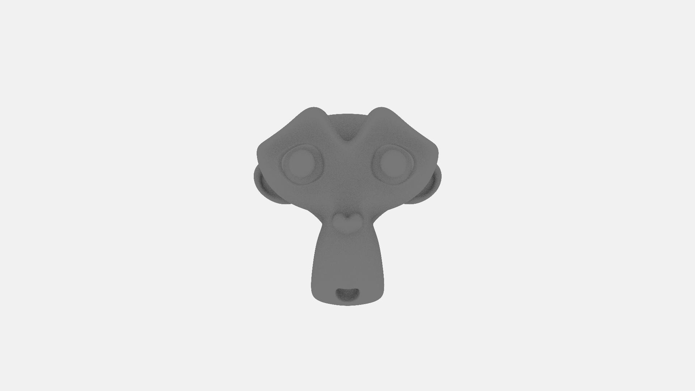
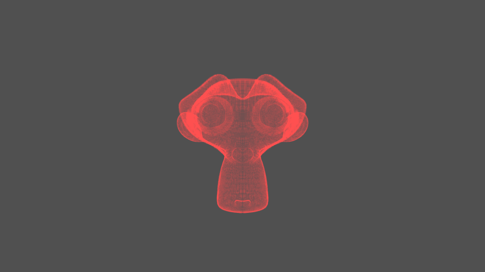
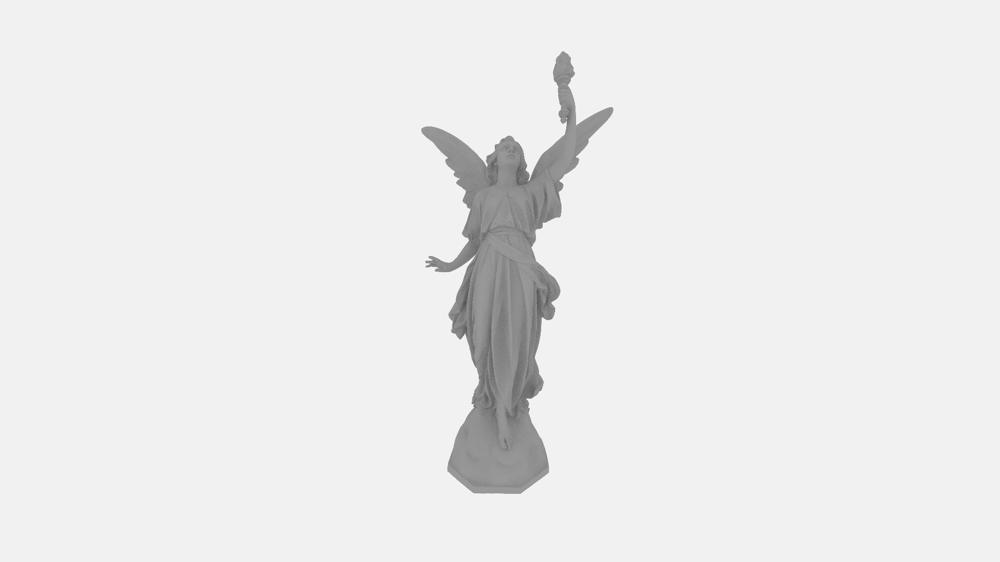

# A CPU ray tracer written in Rust.

Features:
- Partial support for .obj models (only triangulated models)
- Limited support for .mtl files with PBR
- Export to .ppm format
- Simple BVH

Todo:
- Support for other image formats (at least .bmp, maybe .png)
- 3D models
    - Better support for .obj files (textures, normals) OR
    - Just use glTF format for camera support, better PBR materials etc.
- Better BVH
- Multithreaded rendering

Todo (maybe):
- Windowing and GUI for realtime editing of rendering parameters etc.

~250K triangles, 20 spp, 5 max bounces, 1920x1080, ~114 seconds to render

Same model with debug visualization of the BVH

