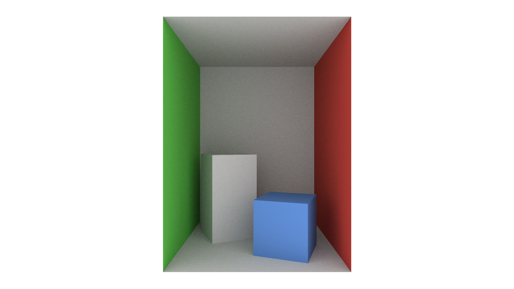
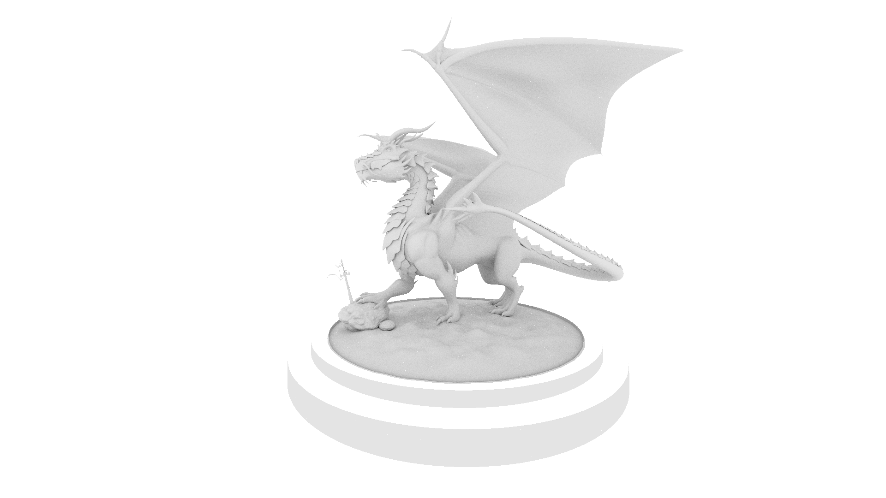
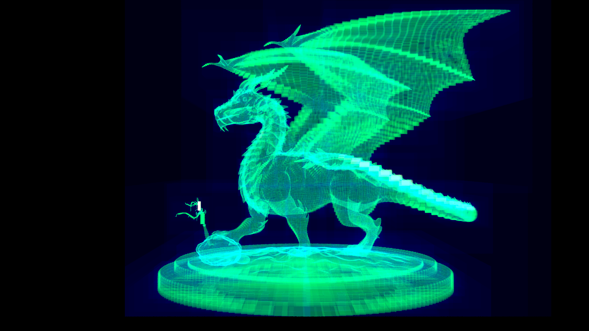
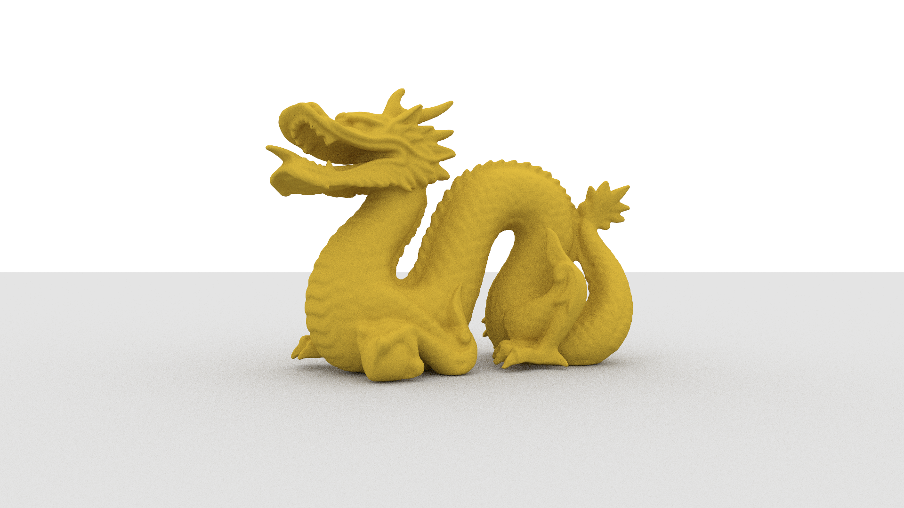

# A CPU ray tracer written in Rust.

Features
--------
- Supports .obj models (only triangulated models)
- Supports .mtl files with PBR
- Limited support for textures
- Smooth shading (vertex normals)
- Simple BVH
- Supported formats for rendering
    - .ppm

Todo
--------
- Support for other output image formats (.bmp, .png)
- glTF support
- Better BVH
- Multithreaded rendering

Todo (later)
--------
- Option to use the GPU for rendering with wgpu

Known issues
--------
- Some .obj exporters don't work with this. The best way to get around this is to bring the model into Blender and export again.

Gallery
--------

--------
The following dragon model is from https://benedikt-bitterli.me/resources/

--------
Chinese dragon model downloaded from Morgan McGuire's [Computer Graphics Archive](https://casual-effects.com/data)

# Resources & references
- [This book series](https://raytracing.github.io/) is *the* best resource for anyone looking to start their own ray tracer.
- A huge shout out to [this blog](https://jacco.ompf2.com/2022/04/13/how-to-build-a-bvh-part-1-basics/) for helping me make the BVH system for this project.
