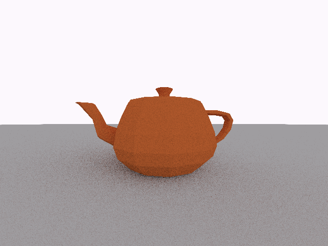

# A CPU ray tracer written in Rust.

Features:
- Support for .obj models
- Limited support for .mtl files with PBR
- Export to .ppm format

Todo:
- Support for other image formats (at least .bmp, maybe .png)
- Better support for .obj models (textures, normals)
- BVH

