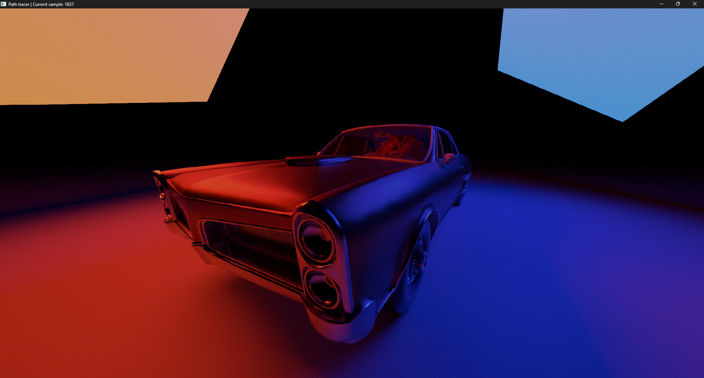
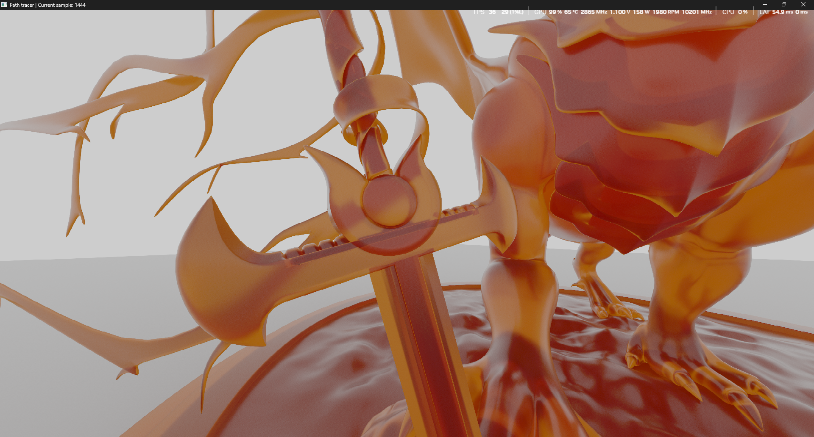
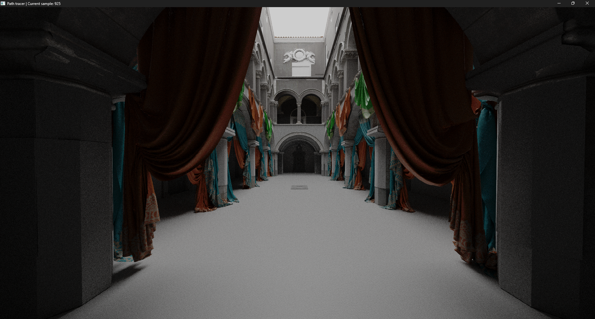
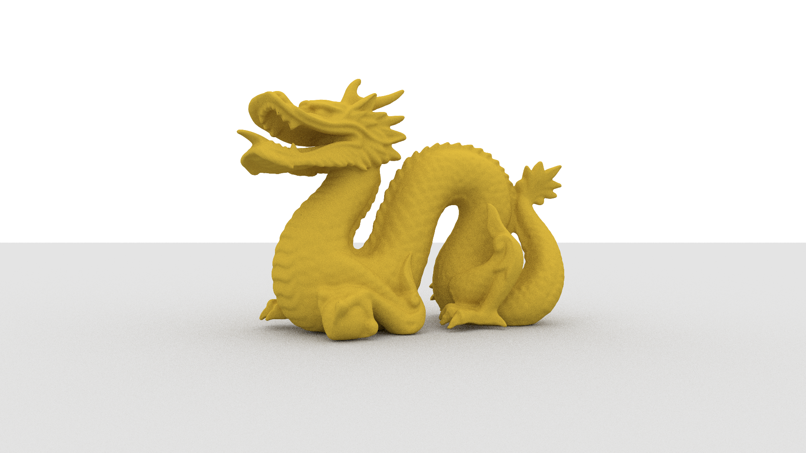

# Path tracer written in Rust

Features
--------
- GPU rendering backend with [wgpu](https://crates.io/crates/wgpu)
    - Realtime mode with [winit](https://crates.io/crates/winit)
- CPU rendering backend, multithreaded with [rayon](https://crates.io/crates/rayon)
    - NOTE: The GPU backend is more feature complete for now & CPU backend only supports offline rendering
- Custom OBJ & MTL loader with some PBR features
- Textures and output images use this [image](https://crates.io/crates/image) crate for decoding and encoding
- Smooth shading (per vertex normals)
- BVH with binned SAH
--------

Todo (in order of priority)
--------
- Proper BSDF system for materials
- Scenes
    - glTF support
- Better BVH
- Bring CPU backend to feature parity with GPU backend
- Command line arguments for scenes and other parameters
--------

Gallery
--------
Damaged helmet model from https://github.com/KhronosGroup/glTF-Sample-Models/tree/main/2.0/DamagedHelmet

--------
Car and dragon models from https://benedikt-bitterli.me/resources/

--------
Sponza model from https://www.intel.com/content/www/us/en/developer/topic-technology/graphics-research/samples.html

--------
Chinese dragon model downloaded from Morgan McGuire's [Computer Graphics Archive](https://casual-effects.com/data)

--------

Resources & references
--------
- [This book series](https://raytracing.github.io/) is *the* best resource for anyone looking to start their own ray tracer.
- A huge shout out to [this blog](https://jacco.ompf2.com/2022/04/13/how-to-build-a-bvh-part-1-basics/) for helping me make the BVH system for this project.
- Sebastian Lague's [video series](https://www.youtube.com/watch?v=Qz0KTGYJtUk&list=PLFt_AvWsXl0dlgwe4JQ0oZuleqOTjmox3) on ray tracing.
--------

Known issues
--------
- Some OBJ exporters might not work with this for various reasons (negative indices, etc.). The best way to get around this is to bring the model into Blender and export again.
--------

Contributing
--------
- Contributions are very much welcome :)
- If you would like to contribute, open an issue on GitHub detailing what you're adding (or what you think should be added / improved / fixed).
- I don't have any specific guidelines on how you should structure the code other than to try to follow the style and structure already in place, unless you think there's a better way.
--------
