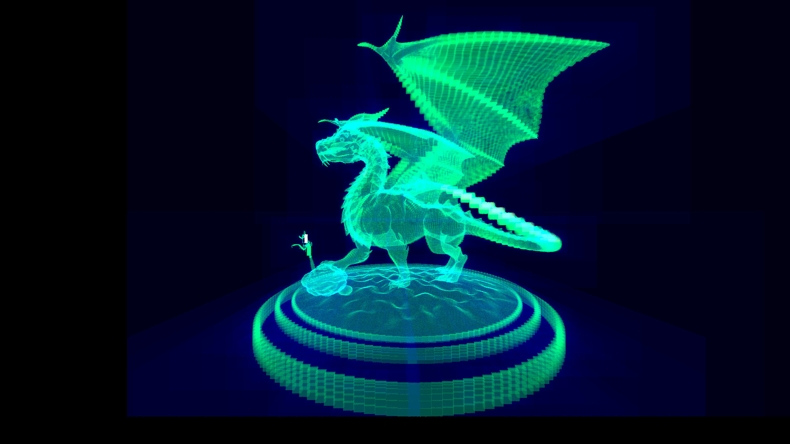

# A CPU ray tracer written in Rust.

Features
--------
- Supports .obj models (only triangulated models, limited support for PBR materials)
- Very limited support for textures (base color and emission for now)
    - .bmp
- Smooth shading (vertex normals)
- BVH
- Supported output image formats
    - .ppm
--------

Todo (in order of priority)
--------
- Implement a proper BRDF system for materials
- Option to use the GPU for rendering
- Command line arguments for scenes and other parameters
- Scenes
    - glTF support
- Support for other output image formats (.bmp, .png)
- Better BVH
- Better multithreaded rendering
--------

Gallery
--------

--------
The following dragon model is from https://benedikt-bitterli.me/resources/

--------
Chinese dragon model downloaded from Morgan McGuire's [Computer Graphics Archive](https://casual-effects.com/data)

--------

Resources & references
--------
- [This book series](https://raytracing.github.io/) is *the* best resource for anyone looking to start their own ray tracer.
- A huge shout out to [this blog](https://jacco.ompf2.com/2022/04/13/how-to-build-a-bvh-part-1-basics/) for helping me make the BVH system for this project.
--------

Known issues
--------
- Some .obj exporters might not work with this for various reasons (negative indices, etc.). The best way to get around this is to bring the model into Blender and export again.
--------

Contributing
--------
- Contributions are very much welcome :)
- If you would like to contribute, open an issue on GitHub detailing what you're adding (or what you think should be added).
- I don't have any specific guidelines on how you should structure the code other than to try to follow the style and structure already in place, unless you think there's a better way.
--------
